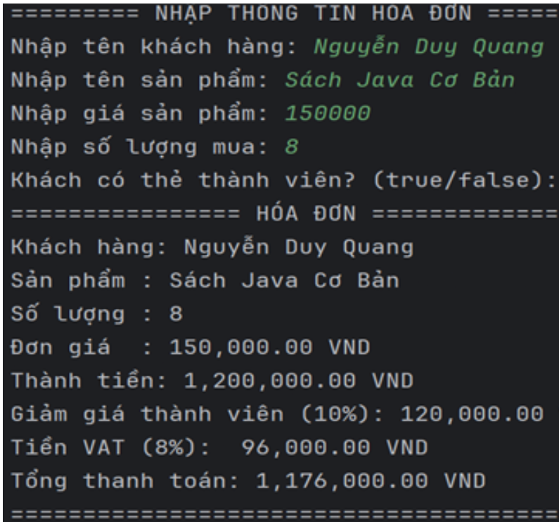

# Đề bài 01 (md02_ss03) - [ Luyện tập ] Tính tiền hóa đơn siêu thị

## Mô tả

Viết chương trình Java Console cho phép người dùng nhập:

- Tên khách hàng
- Tên sản phẩm
- Giá sản phẩm
- Số lượng mua
- Khách có thẻ thành viên hay không (true/false)

Chương trình thực hiện tính:

- Thành tiền = giá * số lượng mua
- Nếu là thành viên giảm 10%
- Tính tiền VAT 8%
- Tổng tiền thanh toán = Thành tiền – Giảm giá + VAT
- In thông tin khách hàng gồm các thông tin: Khách hàng, sản phẩm, số lượng, đơn giá, thành tiền, giảm giá, tiền VAT, tổng thanh toán theo định dạng yêu cầu

## Kết quả mong muốn

| INPUT | OUTPUT |
|-------|--------|
| Tên khách hàng: Nguyễn Duy Quang Sản phẩm: Sách Java Cơ Bản Giá: 150.000 Số lượng: 8 Thẻ thành viên: true | Khách hàng: Nguyễn Duy Quang Sản phẩm: Sách Java Cơ Bản Giá: 150.000 VNĐ Số lượng: 8 Thành tiền: 1.200.000 VNĐ Giảm giá: 120.000 VNĐ Tiền VAT: 96.000 VNĐ Tổng tiền thanh toán: 1.176.000 VNĐ |
| Tên khách hàng: Nguyễn Duy Quang Sản phẩm: Sách CSDL PostgreSQL Giá: 150.000 Số lượng: 2 Thẻ thành viên: false | Khách hàng: Nguyễn Duy Quang Sản phẩm: Sách CSDL PostgreSQL Giá: 150.000 VNĐ Số lượng: 2 Thành tiền: 300.000 VNĐ Giảm giá: 0 VNĐ Tiền VAT: 24.000 VNĐ Tổng tiền thanh toán: 276.000 VNĐ |

