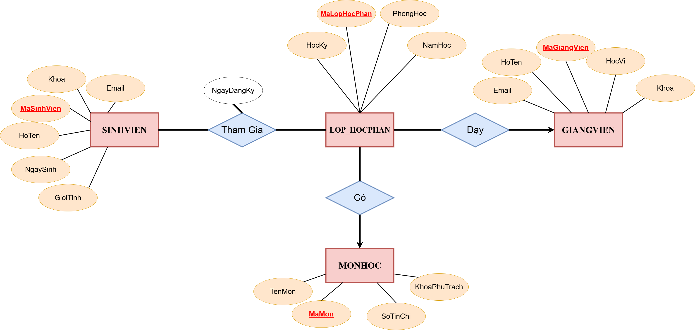

# Session 01 – Tổng quan về Cơ sở dữ liệu (Lý thuyết)

## Context

Bài tập thuộc phần **PostgreSQL / Database Fundamentals** trong quá trình học tại Rikkei Academy.

Mục tiêu của bài này là luyện tập:

* Xác định **thực thể (Entity)**
* Xác định **thuộc tính (Attributes)**
* Phân tích **mối quan hệ (Relationships)**
* Thiết kế **ERD (Entity Relationship Diagram)**

---

## Problem Statement

Một trường đại học cần quản lý việc đăng ký môn học của sinh viên.

Hệ thống lưu trữ các thông tin sau:

### Student

* mã sinh viên
* họ tên
* ngày sinh
* giới tính
* email
* khoa

### Course

* mã môn
* tên môn
* số tín chỉ
* khoa phụ trách

### Instructor

* mã giảng viên
* họ tên
* học vị
* email
* khoa

### Class_Section

* mã lớp học phần
* học kỳ
* năm học
* phòng học

### Enrollment

* ghi lại việc sinh viên đăng ký lớp học phần cụ thể

---

## Requirements

1. Xác định các **thực thể và thuộc tính chính**
2. Xác định **mối quan hệ giữa các thực thể**, ví dụ:

* Giảng viên dạy lớp học phần nào
* Lớp học phần thuộc về môn học nào
* Sinh viên đăng ký lớp học phần nào

3. Vẽ **ERD mô tả đầy đủ các mối quan hệ**

Bao gồm:

* 1–N relationships
* N–N relationships

4. Chỉ rõ:

* Primary Key
* Foreign Key
* Multi-valued attributes (nếu có)

---

## ER Diagram



---

## Solution

Chi tiết phân tích được trình bày trong file:

```
report.md
```
