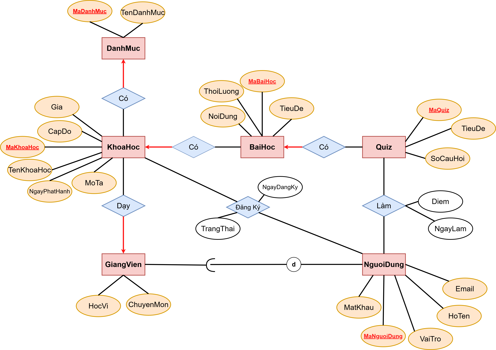

# Session 01 – Bài 4: Hệ Thống Nền Tảng Học Trực Tuyến

## Context

Bài tập áp dụng mô hình **Entity–Relationship (ER)** để mô tả nghiệp vụ của một **nền tảng học trực tuyến** tương tự các hệ thống như Coursera hoặc Udemy.

---

## Learning Objectives

Bài tập giúp luyện tập các kỹ năng sau:

* Phân tích **thực thể và thuộc tính** trong hệ thống nhiều vai trò người dùng
* Thiết kế **mô hình User Role** cho hệ thống lớn
* Xác định **Primary Key (PK)** và **Foreign Key (FK)**
* Phân tích **cardinality của relationship (1–N, N–N)**
* Thiết kế **thực thể trung gian** cho các quan hệ N–N
* Xây dựng **ER Diagram (ERD)** rõ ràng và có khả năng mở rộng

---

## Problem Statement

Một nền tảng học trực tuyến cần quản lý các thông tin sau:

### User

* mã người dùng
* họ tên
* email
* mật khẩu
* vai trò (student / instructor / admin)

### Course

* mã khóa học
* tên khóa học
* mô tả
* cấp độ
* giá
* ngày phát hành

### Category

* mã danh mục
* tên danh mục

### Instructor

* học vị
* chuyên môn

### Enrollment

* mã đăng ký
* ngày đăng ký
* trạng thái

### Lesson

* mã bài học
* tiêu đề
* nội dung
* thời lượng

### Quiz

* mã quiz
* tiêu đề
* số câu hỏi

### Result

* mã kết quả
* điểm
* ngày làm

---

## Requirements

Hệ thống cần thể hiện các mối quan hệ:

* Một giảng viên có thể dạy nhiều khóa học
* Một khóa học thuộc về một danh mục
* Một khóa học có nhiều bài học
* Một bài học có thể có nhiều quiz
* Một học viên có thể học nhiều khóa học
* Một học viên có thể làm nhiều quiz
* Mỗi lần làm quiz sẽ tạo ra một kết quả riêng

---

## ER Diagram

---

## Solution

Chi tiết phân tích được trình bày trong file:
