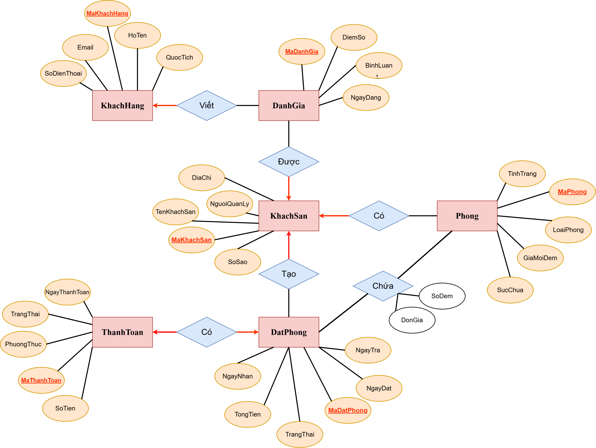

# Session 01 – Bài 3: Hệ Thống Quản Lý Đặt Phòng Khách Sạn

## Context

Bài tập áp dụng mô hình **Entity–Relationship (ER)** để mô tả nghiệp vụ của một **hệ thống đặt phòng khách sạn trực tuyến** tương tự các nền tảng như Booking.com.

---

## Learning Objectives

Bài tập giúp luyện tập các kỹ năng sau:

* Phân tích **thực thể và thuộc tính** trong hệ thống thực tế
* Xác định **Primary Key (PK)** và **Foreign Key (FK)**
* Phân tích **cardinality của relationship (1–N, N–N)**
* Xác định **thực thể trung gian** cho các quan hệ N–N
* Thiết kế **ER Diagram (ERD)** rõ ràng và chuẩn hóa

---

## Problem Statement

Hệ thống đặt phòng khách sạn cần quản lý các thông tin:

### Hotel

* mã khách sạn
* tên khách sạn
* địa chỉ
* số sao
* mô tả
* người quản lý

### Room

* mã phòng
* loại phòng
* giá mỗi đêm
* tình trạng
* sức chứa

### Customer

* mã khách hàng
* họ tên
* email
* số điện thoại
* quốc tịch

### Booking

* mã đặt phòng
* ngày đặt
* ngày nhận phòng
* ngày trả phòng
* tổng tiền
* trạng thái

### Payment

* mã thanh toán
* phương thức thanh toán
* ngày thanh toán
* số tiền
* trạng thái

### Review

* mã đánh giá
* điểm số
* bình luận
* ngày đăng

---

## Requirements

Hệ thống cần thể hiện các mối quan hệ:

* Một khách sạn có nhiều phòng
* Một khách hàng có thể tạo nhiều booking
* Một booking có thể đặt nhiều phòng
* Một booking có đúng một thanh toán
* Một khách hàng có thể viết nhiều đánh giá cho khách sạn

---

## ER Diagram



---

## Solution

Chi tiết phân tích được trình bày trong file:

```
report.md
```
