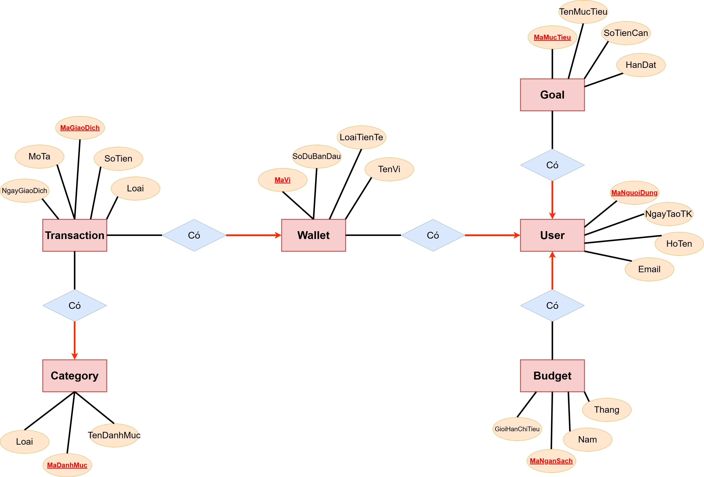

# Session 01 – Bài 5: Hệ Thống Quản Lý Giao Dịch & Phân Tích Tài Chính Cá Nhân

## Context

Bài tập áp dụng mô hình **Entity–Relationship (ER)** để mô tả nghiệp vụ của một **ứng dụng quản lý tài chính cá nhân**, giúp người dùng theo dõi chi tiêu, thu nhập, ngân sách và mục tiêu tiết kiệm.

Hệ thống có thể mở rộng để phục vụ **phân tích dữ liệu tài chính và dashboard BI**.

---

## Learning Objectives

Bài tập giúp luyện tập các kỹ năng sau:

* Phân tích **thực thể và thuộc tính** trong hệ thống quản lý tài chính
* Thiết kế **quan hệ dữ liệu theo người dùng**
* Xác định **Primary Key (PK)** và **Foreign Key (FK)**
* Phân tích **cardinality của relationship (1–N, N–N)**
* Chuẩn hóa dữ liệu đến **3NF / BCNF**
* Thiết kế **ER Diagram (ERD)** có khả năng mở rộng cho hệ thống phân tích dữ liệu

---

## Problem Statement

Một ứng dụng quản lý tài chính cá nhân cần quản lý các thông tin sau:

### User

* mã người dùng
* họ tên
* email
* ngày tạo tài khoản

### Wallet

* mã ví
* tên ví
* số dư ban đầu
* loại tiền tệ

### Category

* mã danh mục
* tên danh mục
* loại (thu / chi)

### Transaction

* mã giao dịch
* ngày giao dịch
* số tiền
* mô tả
* loại (thu / chi)

### Budget

* mã ngân sách
* tháng
* năm
* giới hạn chi tiêu

### Goal

* mã mục tiêu
* tên mục tiêu
* số tiền cần
* hạn đạt

### Recurring Transaction (Optional)

* giao dịch lặp lại hàng tháng

---

## Requirements

Hệ thống cần thể hiện các mối quan hệ:

* Một người dùng có nhiều ví
* Một ví có nhiều giao dịch
* Một danh mục có nhiều giao dịch
* Một người dùng có nhiều ngân sách
* Một người dùng có nhiều mục tiêu tiết kiệm
* Một danh mục có thể được sử dụng bởi nhiều người dùng

---

## ER Diagram



---

## Solution

Chi tiết phân tích được trình bày trong file:
```
report.md
```
