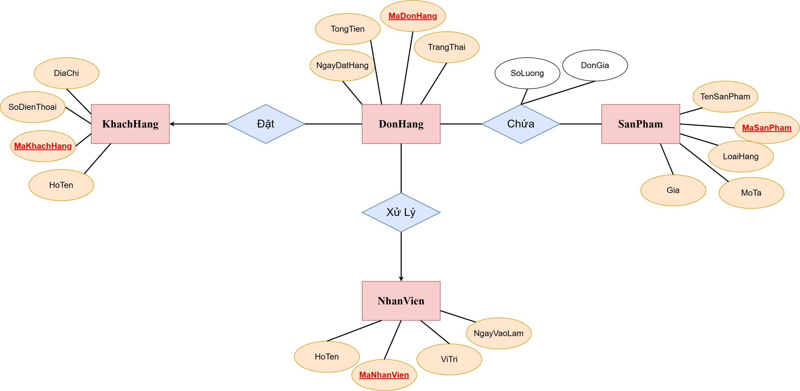

# Session 01 - Bài 2: Hệ Thống Quản Lý Đơn Hàng Thương Mại Điện Tử

## Context

Bài tập thuộc phần **PostgreSQL / Database Fundamentals** trong quá trình học tại Rikkei Academy.

Mục tiêu của bài tập là áp dụng mô hình **Entity–Relationship (ER)** để mô tả nghiệp vụ của một **hệ thống bán hàng trực tuyến (online sales system)**.

---

## Learning Objectives

Bài tập giúp luyện tập các kỹ năng sau:

* Xác định **Entity (thực thể)** trong một hệ thống thực tế
* Phân tích **Attributes (thuộc tính)** của từng thực thể
* Xác định **Relationships (mối quan hệ)** giữa các thực thể
* Phân biệt **1–N** và **N–N relationships**
* Chuẩn hóa mô hình dữ liệu để **tránh dư thừa và phụ thuộc dữ liệu**

---

## Problem Statement

Một trang web bán hàng trực tuyến cần quản lý các thông tin sau:

### Customer

* mã khách hàng
* họ tên
* email
* số điện thoại
* địa chỉ

### Product

* mã sản phẩm
* tên sản phẩm
* giá
* mô tả
* loại hàng

### Order

* mã đơn hàng
* ngày đặt hàng
* tổng tiền
* trạng thái

### OrderDetail

* số lượng
* đơn giá tại thời điểm mua

### Staff

* mã nhân viên
* họ tên
* vị trí
* ngày vào làm

---

## Requirements

1. Xác định **các thực thể và thuộc tính chính**

2. Xác định **các mối quan hệ giữa thực thể**, ví dụ:

* Khách hàng đặt nhiều đơn hàng
* Một đơn hàng có thể chứa nhiều sản phẩm
* Nhân viên xử lý đơn hàng

3. Thiết kế **ERD (Entity Relationship Diagram)** thể hiện:

* Các thực thể
* Các mối quan hệ
* Cardinality (1–N, N–N)

4. Chỉ rõ trong sơ đồ:

* Primary Key (PK)
* Foreign Key (FK)

---

## ER Diagram



---

## Solution

Chi tiết phân tích được trình bày trong file:

```
report.md
```
